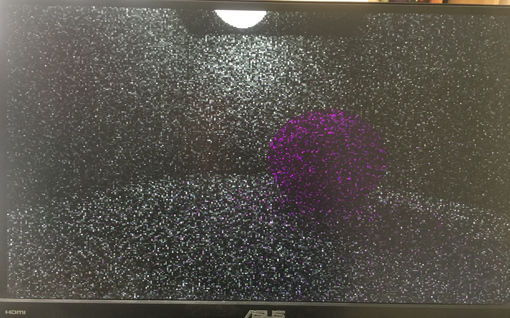
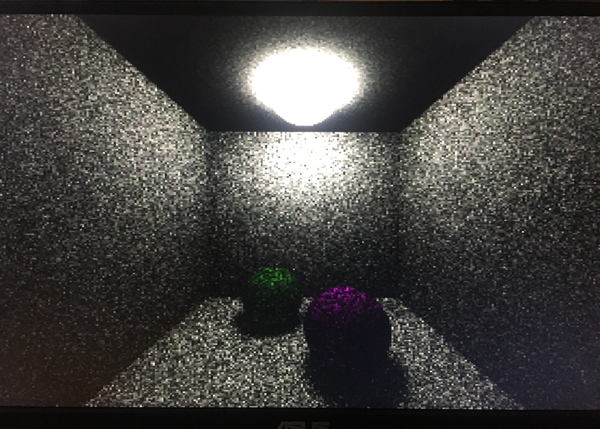

# Pathtracer

A pathtracer built from the ground up!

This code was originally created to be run on the DE1-SoC development board for the class "Embedded Design: Enabling Robotics".

### Some results!

These results took a long time to trace, and are pretty cool for such a low powered device.

### Caveats and continuation

The project files are currently in flux; I started to switch the rendering to use SFML, rather than display output via the custom VGA controller that I wrote for the DE1-SoC, but this process has not yet been completed. Since I "finished" the project for my class, I can also think of many ways to clean up the code that I have written, but have not gotten around to it yet. Feel free to check back from time to time for updates, but no promises!

Ideas for improvement in the future:
- general refactoring
- add multithreading or GPU rendering
- allow for refraction alongside the diffuse and specular surfaces that have already been implemented
- move away from using my own vector library (had to do use it for the class project)
